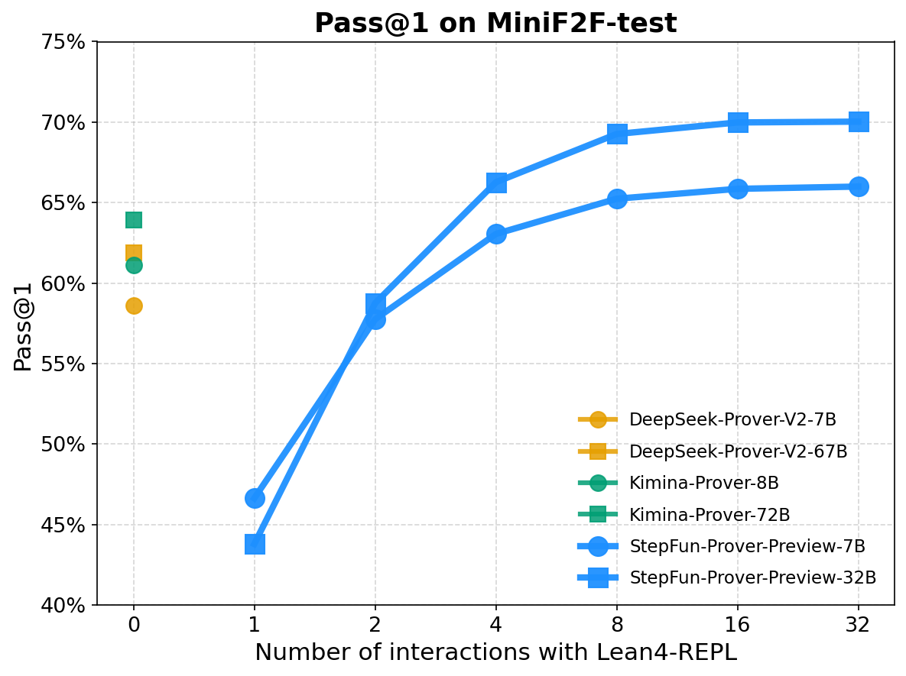

# StepFun-Prover-Preview

<p align="center">
  <br>
</p>

<div align="center"> 
  <a href="https://arxiv.org/abs/2507.20199"></a> &ensp;
  <a href="https://huggingface.co/stepfun-ai/Stepfun-Prover-Preview-32B"></a> &ensp;
</div>
<br>

## Introduction

We introduce StepFun-Prover-Preview, large language models designed for formal theorem proving through tool-integrated reasoning. Using a reinforcement learning pipeline that incorporates tool-based interactions, StepFun-Prover Preview can achieve strong performance in generating Lean 4 proofs with minimal sampling. Our approach enables the model to emulate human-like problem-solving strategies by iteratively refining proofs based on real-time environment feedback. On the miniF2F-test benchmark, StepFun-Prover-Preview-32B achieves a pass@1 success rate of $70\%$. Please refer to our [technical report](https://arxiv.org/abs/2507.20199) for more details.

<p align="center">
  
</p>

**Figure 1:** Performance comparison on MiniF2F-test. y-axis shows the pass@1, which is computed by averaging 32 trials; while x-axis denotes the maximum number the provers are allowed to interact with Lean4-REPL before getting successful proof. Note both DeepSeek-Prover and Kimina-Prover utilize at least 32K token context length. Stepfun-Prover was evaluated using 20K context window including feedback from Lean4-REPL.

## Methodology

<p align="center">
  
</p>

**Figure 2:** Our training pipeline. Left. Tool-integrated RL and iterative RL-SFT cycle. The upper left illustrates data preparation. Right. Tool-integrated reasoning pattern.

## Experimental Results

<div align="center">

| Model                        | MiniF2F-test (Pass@1)  |
|------------------------------|---------|
| DeepSeek-Prover-V2-7B        | 58.6%   |
| DeepSeek-Prover-V2-671B      | 61.9%   |
| Kimina-Prover-8B             | 61.1%   |
| Kimina-Prover-72B            | 63.9%   |
| StepFun-Prover-Preview-7B    | 66.0%   |
| StepFun-Prover-Preview-32B   | 70.0%   |
</div>

**Tabel 1:** Performance comparison of theorem proving models on the miniF2F-test dataset under minimal sampling budgets. For StepFun-Provers, we generate 32 responses per query to estimate Pass@1. 

<div align="center">

| Maximum generation length | MiniF2F-test (Pass@1)   |
|--------------------------|---------|
| 4096                     | 58.3%   |
| 8192                     | 66.5%   |
| 12288                    | 68.9%   |
| 16384                    | 69.9%   |
| 20480                    | 70.0%   |
</div>

**Table 2:** Performance of StepFun-Prover-Preview-32B on MiniF2F-test with various maximum generation lengths. Longer response can get better results.

## Model Download

<div align="center">
  
| Model | Download |
| -------- | -------- |
|    Stepfun-Prover-Preview-7B    |   [🤗HuggingFace](https://huggingface.co/stepfun-ai/Stepfun-Prover-Preview-7B)    |
|    Stepfun-Prover-Preview-32B    |   [🤗HuggingFace](https://huggingface.co/stepfun-ai/Stepfun-Prover-Preview-32B)    |

</div>

## License
Both the code repository and the model weights are released under the  Apache License (Version 2.0).


## Citation

```latex
@misc{stepfunprover2025,
  title={StepFun-Prover Preview: Let's Think and Verify Step by Step},
  author={Shang, Shijie and Wan, Ruosi and Peng, Yue and Wu, Yutong and Chen, Xiong-hui and Yan, Jie and Zhang, Xiangyu},
  year={2025},
  eprint={2507.20199},
  archivePrefix={arXiv},
  primaryClass={cs.AI},
  url={https://arxiv.org/abs/2507.20199},
}
```
